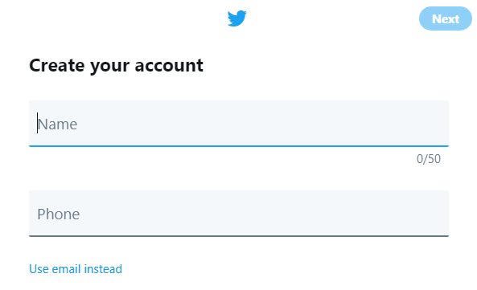
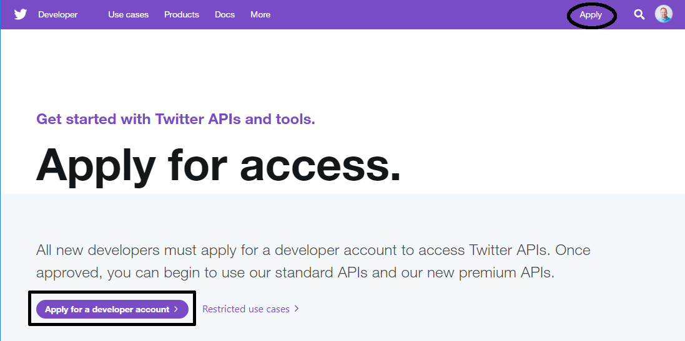
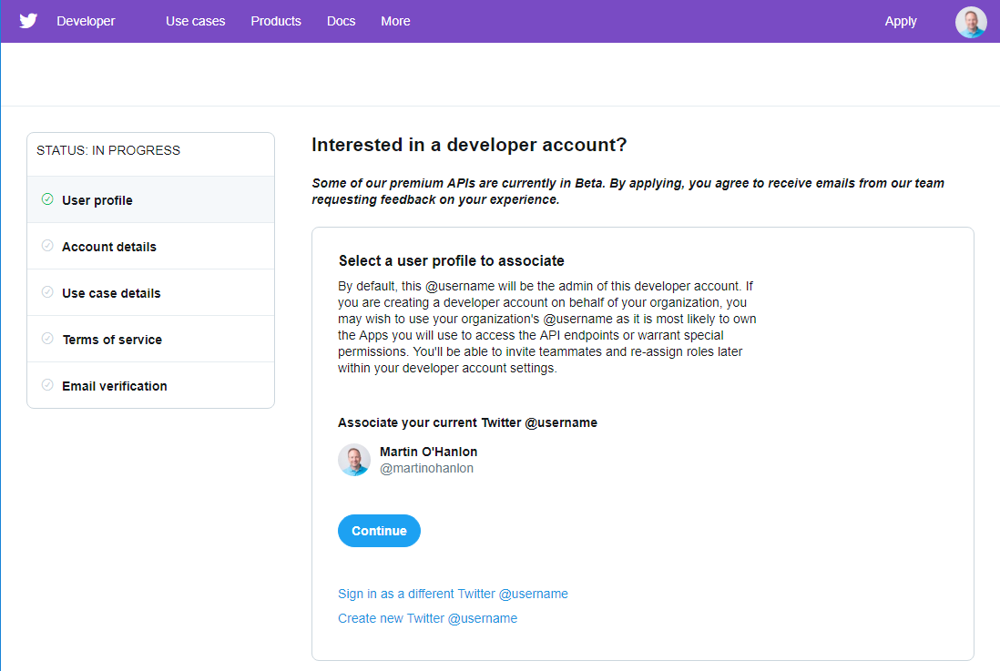
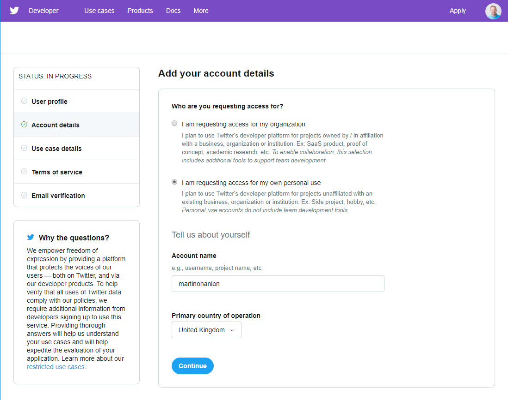
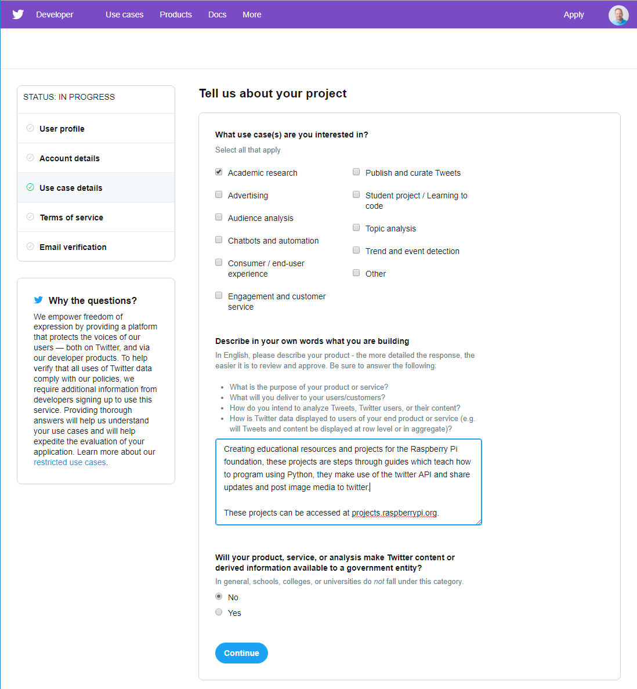
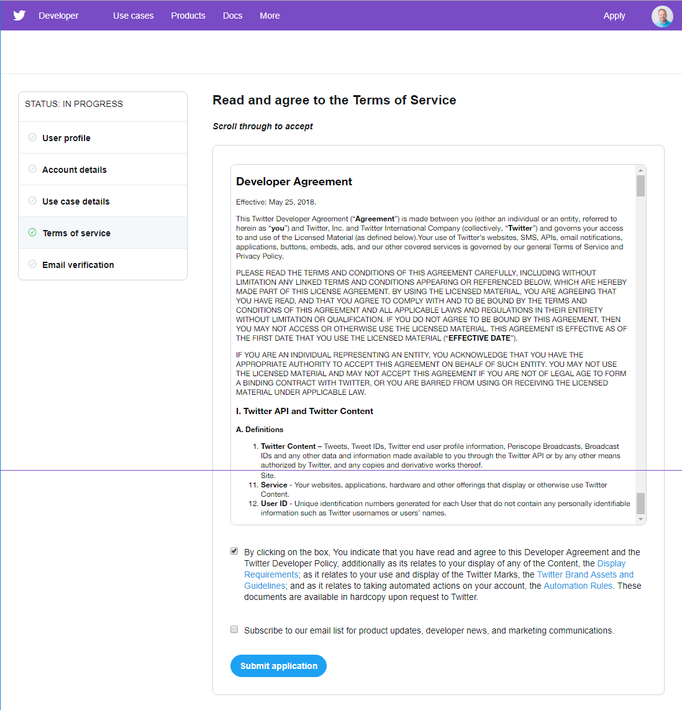

## Apply for a Twitter developer account

If you don't already have a Twitter account, you need to create one before you can apply for a developer account.

- Create a Twitter account at [twitter.com](https://twitter.com).

    

If you want to, you can upload a photo and fill out the bio.

- Apply for a developer account at [developer.twitter.com](https://developer.twitter.com).

    

- Complete the application process and submit your application.

--- collapse ---

---
title: How to complete the developer application
---

- Select the Twitter account you wish to apply with.

    

- Indicate whether you are requesting access for an organisation or for yourself, and confirm your primary country.

    

- Provide details about your project and describe what you will be doing.

    

- Read and agree to the **Terms of Service**.

    

--- /collapse ---

- You will receive an email from Twitter asking you to **confirm your email address**; follow the link in the email to confirm.

**Note**: once you confirm your email address, you need to wait for your application to be approved. This may take some time, and you can check the status of your application at [developer.twitter.com](https://developer.twitter.com).

