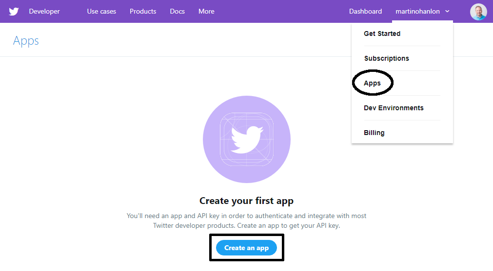
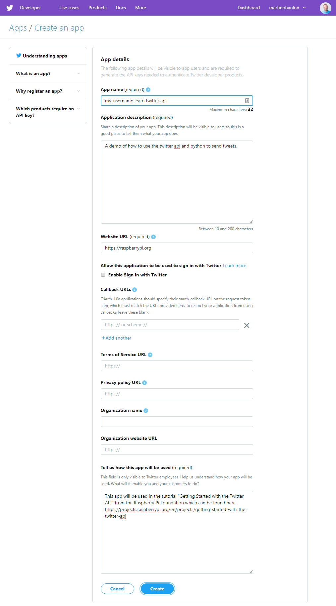
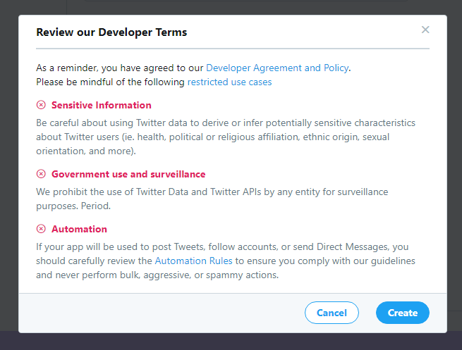
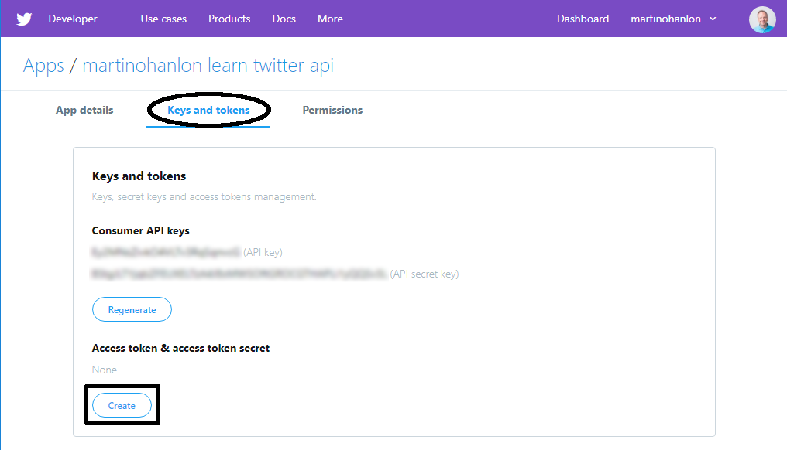
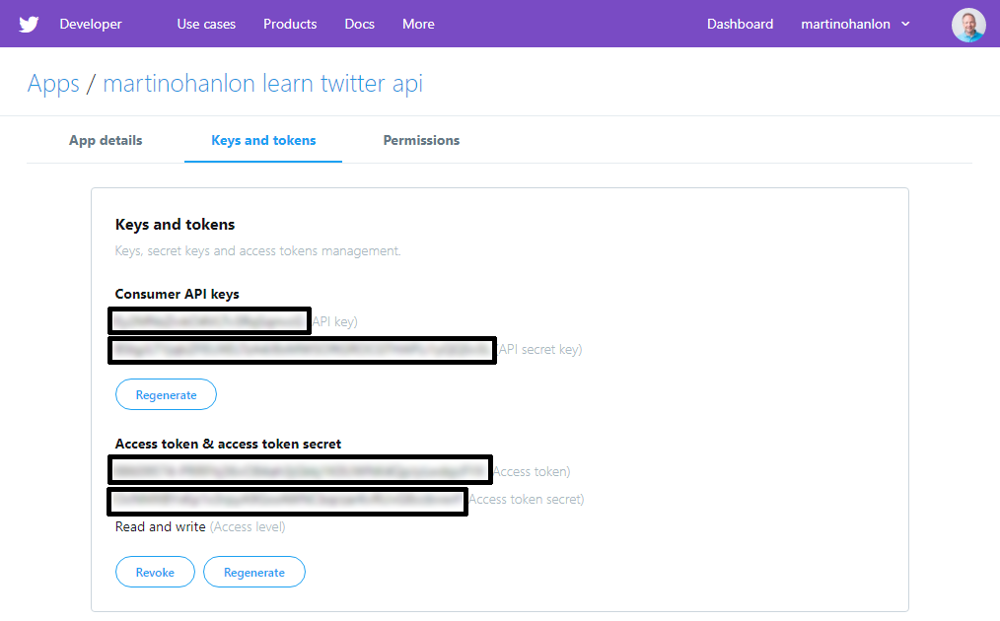

## Create a Twitter application

After your developer account has been approved, you need to register your application with Twitter to get keys. These keys allow you to access your Twitter account from your Python program using the Twitter API (Application Programming Interface).

- Go to [developer.twitter.com](https://developer.twitter.com), select **Apps** from the menu, and click on the **Create an app** button.

    

- Complete the application details form. You must enter an app name, description, website (this can be *https://www.raspberrypi.org/* if you don't have one), and some information about how the app will be used. You can leave the other fields blank. Then click **Create**.

    

- Review the Developer Terms and click on **Create**.

    

- Click on the **Keys and tokens** tab to view your keys and access tokens.

- Click on the **Create** button under **Access token & access token secret**.

    

- You should now see your **Consumer API key**, **Consumer API secret key**, **Access token**, and **Access token secret**. You need these four keys to connect to your Twitter account from your Python program.

**Don't share these keys with anyone**, because they allow access to your Twitter account without your account password. If you share your code online, make sure not to include these keys. 

If you ever accidentally share or publish the keys, you should **regenerate** them at [developer.twitter.com](https://developer.twitter.com).

