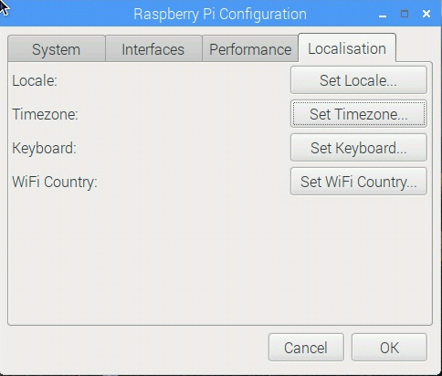
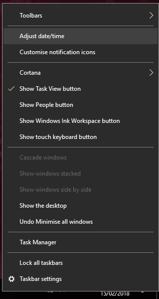

## Set the system date/time

Your system's date/time will be need to be set correctly in order for you to connect to Twitter. On most operating systems, this information is pulled from the internet, but your system might might be set to manual or to the wrong time zone.

If your date and time are correct, you can skip to the next step.

--- collapse ---

---
title: Setting the time on a Raspberry Pi
---

- Set the time zone in the **Raspberry Pi Configuration Tool**.



- If the date/time is still wrong, open a terminal window and enter the following command with the current time and date:

    ```bash
    sudo date -s "31 APR 2015 09:26:53"
    ```
--- /collapse ---

--- collapse ---

---
title: Setting the time on Windows
---

- Right-click on the time and date on the taskbar.

- Select **Adjust date/time** from the menu.



--- /collapse ---

---
title: Setting the time on macOS
---

- Click on the Apple symbol in the top left-hand corner, and then on **System Preferences** > **Date and Time**.

--- /collapse ---


