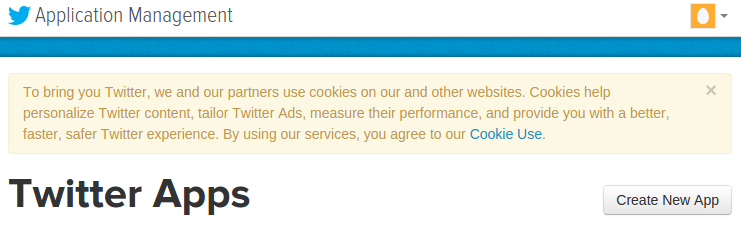
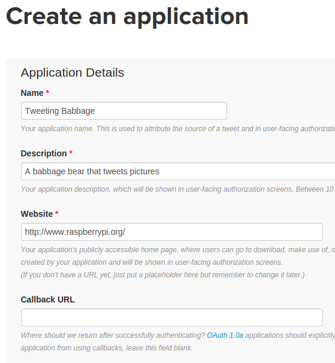
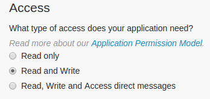
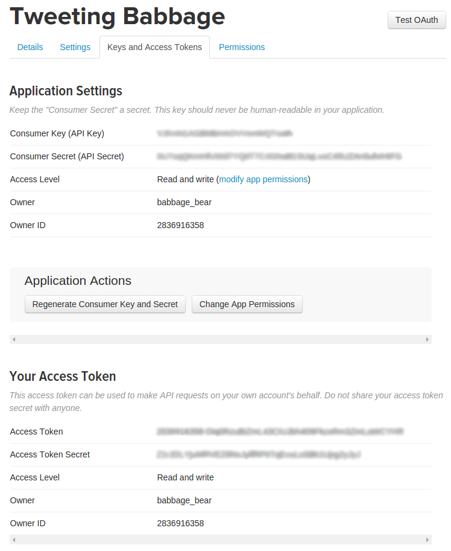

## Create a Twitter application

You need to register your application with Twitter to get keys; these allow you to access the Twitter account from Python using the Twitter API (Application Programming Interface).

- Go to [apps.twitter.com](https://apps.twitter.com) and click the **Create New App** button.

    

- Complete the application details form. You must enter an application name, description, and website (this can be `https://www.raspberrypi.org/` if you don't have one). Leave the 'Callback URL' field blank and proceed.

    

- Modify your app permissions from **Read only** to **Read and write**.

    

- Click the 'Keys and Access Tokens' tab and create an access token.

- Once you've clicked the **Create an Access Token** button, refresh the page and you'll see a new section beneath the **Application Settings** with your access token details.

- You should now be able to see your **Consumer key**, **Consumer secret**, **Access token**, and **Access token secret**. You'll need these four keys to connect to your Twitter account from your Python code. Don't share these keys with anyone, as they can be used without the account's password. If you share your code online, make sure not to include these keys. If you ever accidentally share or publish these keys, you should regenerate the keys at [apps.twitter.com](https://apps.twitter.com).

