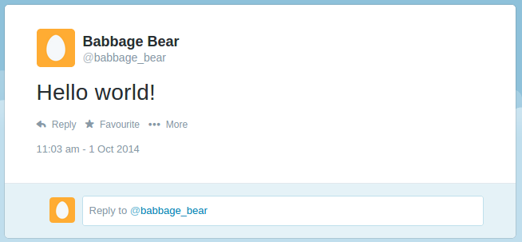
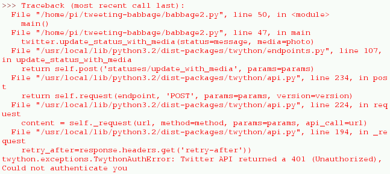

## Send a tweet from Python

Now you have your API keys, and your date/time is set correctly, you're ready to send a tweet from Python!

- Open Python 3 from the Programming menu.

- Create a new file and paste your API keys from [apps.twitter.com](https://apps.twitter.com) into variables, like so:

    ```python
    consumer_key        = 'ABCDEFGHIJKLKMNOPQRSTUVWXYZ'
    consumer_secret     = '1234567890ABCDEFGHIJKLMNOPQRSTUVXYZ'
    access_token        = 'ZYXWVUTSRQPONMLKJIHFEDCBA'
    access_token_secret = '0987654321ZYXWVUTSRQPONMLKJIHFEDCBA'
    ```

- Save the file as `auth.py`.

- Create another new file and import `Twython` from the `twython` module:

    ```python
    from twython import Twython
    ```

- Also, import the variables from `auth.py`:

    ```python
    from auth import (
        consumer_key,
        consumer_secret,
        access_token,
        access_token_secret
    )
    ```

Save this file as `twitter.py`.

- Make a connection with the Twitter API using this set of keys:

    ```python
    twitter = Twython(
        consumer_key,
        consumer_secret,
        access_token,
        access_token_secret
    )
    ```

- Start with a basic "Hello world" tweet to test the connection works:

    ```python
    message = "Hello world!"
    twitter.update_status(status=message)
    print("Tweeted: %s" % message)
    ```

This uses the API's `update_status()` function to send a tweet containing the text "Hello world!".

- Now save (`Ctrl + S`) and run with `F5`. You should see the message "Tweeted: Hello world!". Go to your Twitter profile in a web browser to verify it was sent! This will be at `twitter.com/username`, where `username` is your Twitter account's username.



Note that sending multiple tweets with the exact same text are classed as duplicates and rejected by Twitter. If you want to test it again, try tweeting a different message.

If you see an error, your API keys may be incorrect. Be sure to copy them exactly and check the spelling of the variables. You should also check that your Pi is connected to the internet.



--- collapse ---

---
title: Completed code
---

```python
from twython import Twython
from auth import (
    consumer_key,
    consumer_secret,
    access_token,
    access_token_secret
)

twitter = Twython(
    consumer_key,
    consumer_secret,
    access_token,
    access_token_secret
)

message = "Hello World!"
twitter.update_status(status=message)
print("Tweeted: " + message)
```

--- /collapse ---