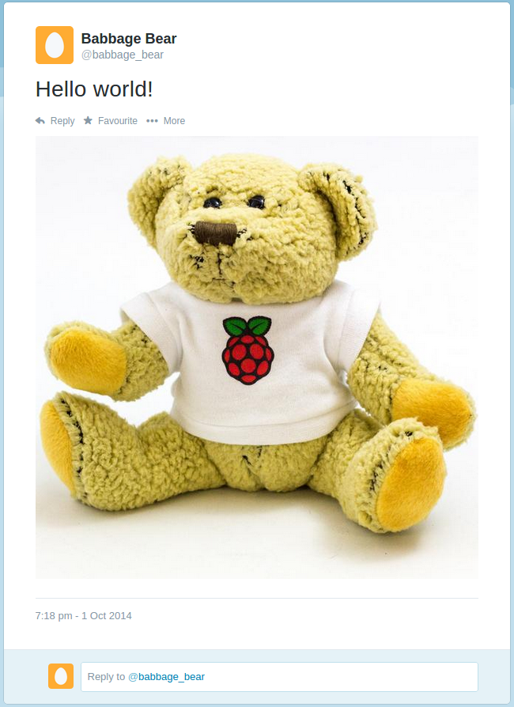

## Tweet a picture

Now that the Twitter connection has been tested, try to upload a picture.

- Find a picture, copy it to your Raspberry Pi or download it from the internet, and save it. Make a note of its location (something like `/home/pi/Downloads/image.jpg`).

- Modify the code accordingly:

    ```python
    message = "Hello world - here's a picture!"
    with open('/home/pi/Downloads/image.jpg', 'rb') as photo:
        twitter.update_status_with_media(status=message, media=photo)
    ```

    Make sure to specify the full path to the image correctly.

    This opens the file and uses the `update_status_with_media()` function to upload the image, along with the tweet text.

- Run the code and see if it tweets the text and image together!

    

To take this further, you could take your own pictures with the camera module and tweet those.

